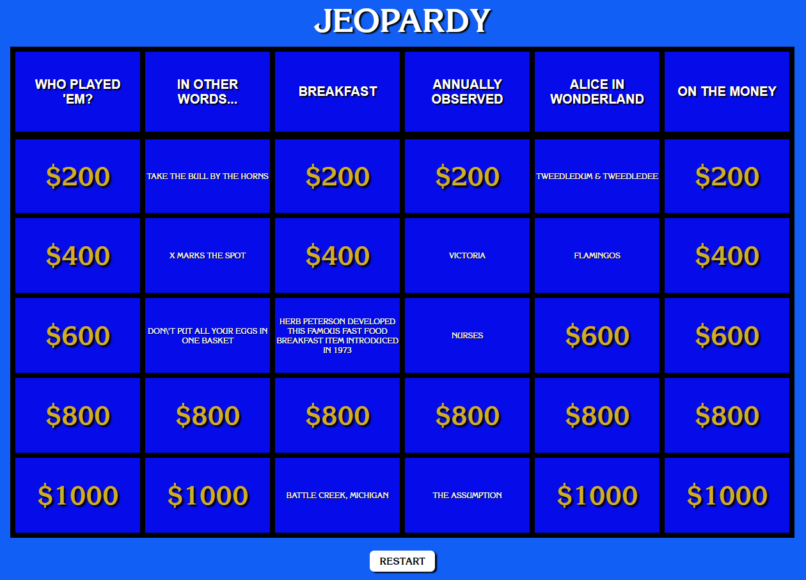

# Jeopardy "Game"
This Jeopardy app utilizes a Jeopardy API to auto-generate a random set of categories and a random set of questions for each category. These are placed into a game "board", which the user can click on to access each question, and again to bring up the answer.

     

     

## My Contribution
This app was almost entirely written by me. Some very skeletal starter code was provided, namely some basic HTML and some JavaScript function definitions, but without any content in them. Thus, I was expected to fill out those functions and work them together, as well as provide for styling. I had my own ideas on how to structure the app, but I chose to work within the function definitions provided to stretch myself into another's way of thinking.
